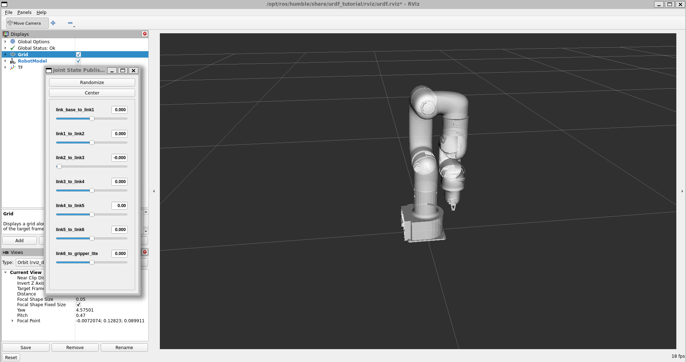

# uFactory xArm Lite 6 – Assembly & Visualization  
Repository: [https://github.com/MisterCircuit/ufactory-xarm-lite-6](https://github.com/MisterCircuit/ufactory-xarm-lite-6)

This project contains the mechanical build files and ROS/URDF setup for the uFactory xArm Lite 6 robotic arm. It includes visualization support via ROS and RViz so you can clone this repo and view the arm in a simulated environment.




---

## Prerequisites  
Make sure your machine has:

- Ubuntu 22.04 (or a compatible distro)  
- ROS2 installed  
- RViz (part of the ROS installation)  
- ROS URDF Tutorial package (required for launching and visualizing URDF)
 

---
## Check if you have urdf tutorial installed
```bash
apt list --installed
```
If not, install urdf tutorial for your ROS distribution, for ros humble

Update your apt repository
```bash
sudo apt update
```

Installation
```bash
sudo apt install ros-humble-urdf-tutorial
```
## 1 Create workspace for the repository and navigate to the src folder
```bash
mkdir -p ufactory_xarm6_ws/src
cd ufactory_xarm6_ws/src 
```
## 2 Clone the Repository 
```bash
git clone https://github.com/MisterCircuit/ufactory-xarm-lite-6.git 
```
Navigate back to the workspace
```bash 
cd ..  
```
## 3 Build the ROS 2 package
```bash
colcon build --symlink-install
```
## 3 Source your workspace
```bash
source install/setup.bash
```
## 4 Launch Rviz Visualization
```bash
ros2 launch urdf_tutorial display.launch.py model:=$PWD/src/ufactory-xarm-lite-6/urdf/robott.urdf
```
Once RViz opens, robot should appear, you should be able to enable joint displays

## Contribution & Support

Open an Issue for bugs or suggestions
Submit a Pull Request to improve modeling or control

## If the project helps you, consider giving it a star!
